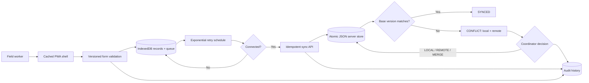

# OpenRelief

**Software Engineering · Offline Systems · Data · Security**

OpenRelief is an offline-first field-data reference where loss of connectivity changes synchronization—not whether a worker can collect validated records.

## Problem

Field tools designed around permanent connectivity fail in rural surveys, humanitarian operations, agricultural work, disaster response, and remote inspections. Pages may not load, submissions disappear, and workers are blocked until a network returns.

## Who This Helps

NGOs, field researchers, response coordinators, agricultural survey teams, inspection teams, and engineers designing systems for intermittent networks.

## Why It Matters

A connection failure must not erase observations or stop essential collection. Equally, reconnecting must not silently overwrite a coordinator's newer edit. The system needs local durability, idempotent transfer, visible state, explicit conflict decisions, and audit evidence.

## Constraints

Core collection must work after the app shell has loaded and while offline. Forms are versioned. Mutations may be retried or arrive after remote changes. The reference must run without paid infrastructure, but must not pretend development identity headers are production authentication.

## Solution

The browser caches its app shell through a service worker and stores pending mutations in IndexedDB. Every record carries form version, record version, device, creator/updater, timestamps, mutation ID, base version, and sync state. Reconnection triggers bounded exponential retry. The server validates against the exact active form, treats repeated mutation IDs idempotently, accepts matching base versions, and returns both local and remote copies when versions diverge. Authorized coordinators resolve with local, remote, or explicitly merged values; every material transition is audited.

## Architecture



See [architecture](docs/architecture.md), [security](docs/security.md), and [threat model](docs/threat-model.md).

## Implemented Features

- Installable responsive web app with cached HTML, JavaScript, and manifest.
- IndexedDB local mutation queue and offline form submission.
- Connection indicator, local queue count, manual sync, and automatic reconnect sync.
- Exponential retry delay capped at five minutes.
- Configurable versioned forms with text, number, boolean, and select fields.
- Required, type, option, range, and unknown-field validation.
- Roles: `ADMIN`, `COORDINATOR`, `FIELD_WORKER`, and `REVIEWER`.
- Separate form-management, record-write, conflict-resolution, and audit-read permissions.
- Record/device/user timestamps and `PENDING`, `SYNCED`, `CONFLICT`, `FAILED` states.
- Mutation-ID idempotency and base-version optimistic concurrency.
- Conflicts retain complete local and remote records without overwriting the server copy.
- Explicit `LOCAL`, `REMOTE`, or validated `MERGE` resolution.
- Append-oriented audit events for forms, records, conflicts, and resolution strategy.
- Atomic mode-600 local server-state replacement.
- REST forms, sync, conflicts, resolution, audit, health, and static app endpoints.

## Technology Stack

Strict TypeScript defines synchronization, form, role, conflict, and audit contracts. Fastify provides the local REST/static server. Zod validates HTTP inputs. The browser uses standards-based Service Worker, Cache Storage, IndexedDB, online/offline events, and Fetch APIs without a frontend framework. A file-backed atomic store keeps local deployment inspectable; the store interface can be replaced by PostgreSQL for multi-process deployment.

## Setup and Usage

```bash
npm ci
npm run typecheck
npm test
npm run build
OPENRELIEF_DATA=./data/openrelief.json npm start
```

Open `http://127.0.0.1:3001`, submit assessments, switch the browser offline, continue collecting, then reconnect and synchronize.

API development identity example:

```bash
curl http://127.0.0.1:3001/api/forms
curl http://127.0.0.1:3001/api/conflicts \
  -H 'x-user-id: coordinator-1' -H 'x-user-role: COORDINATOR'
```

These headers are an explicit local-development adapter, not secure authentication.

Container:

```bash
docker compose up --build -d
curl http://127.0.0.1:3001/health
```

## Testing

```bash
npm run typecheck
npm test
npm run build
npm audit --audit-level=high
```

Tests prove validation, offline record construction, idempotent retries, conflict detection without overwrite, merged resolution, audit strategy, role denial, exponential retry bounds, and complete API behavior.

## Security

Field records may contain personal or safety-critical data. The local web store is protected only by browser/device security. Production requires device encryption, screen lock, remote wipe, authenticated users, short sessions with an offline policy, tenant/assignment authorization, TLS, server encryption, retention/deletion, backup, and audit export. Never trust role headers outside this loopback reference.

## Limitations

- Development identity headers are deliberately not production authentication.
- The browser example includes one bundled assessment form; the API supports additional forms but the UI needs a dynamic renderer for them.
- File storage supports one server process; multi-instance operation requires transactional shared storage.
- Service workers need HTTPS outside localhost and browser storage can be cleared by users or device policy.
- The system cannot decide which conflicting real-world observation is correct; an authorized human must resolve it.
- No attachments, GPS, map, background-sync API dependency, encryption-at-field level, or remote device administration.

## Contributing

Read [CONTRIBUTING.md](CONTRIBUTING.md). Sync changes require offline, retry, idempotency, conflict, authorization, and audit tests. Use synthetic field data only.
