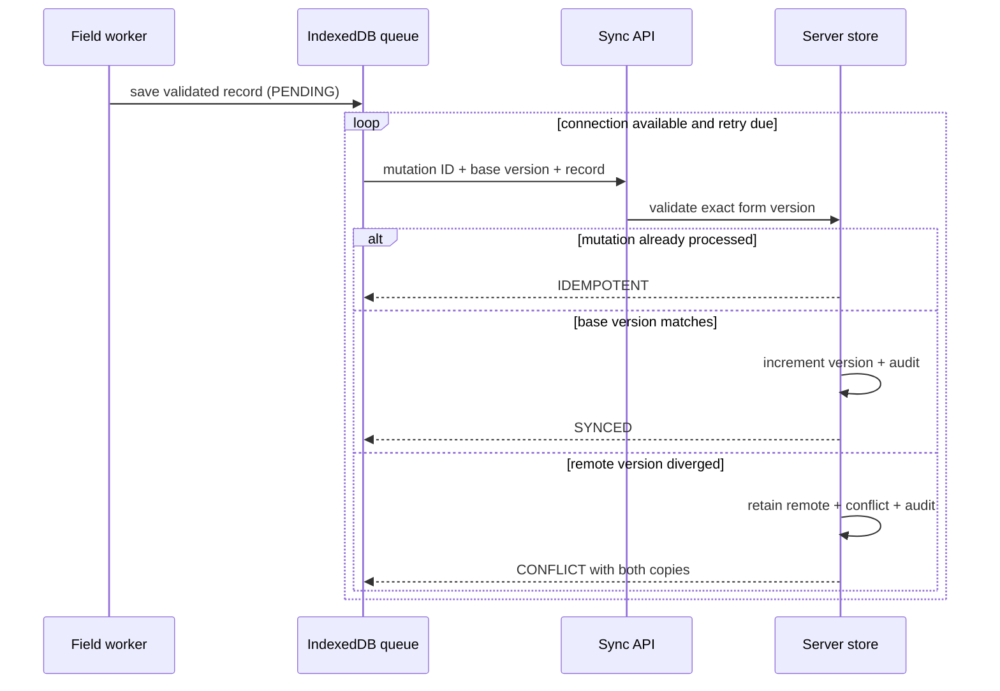

# OpenRelief Architecture

## Offline boundary

The service worker caches only the application shell and GET responses. New records are written to IndexedDB first, so a POST is never the sole copy. Queue entries contain a stable mutation ID, base record version, device and user provenance, enqueue time, attempts, and next attempt. Online events trigger synchronization, but users can also initiate it explicitly.

## Consistency model

OpenRelief uses eventual consistency with optimistic concurrency. Creation starts at version zero. The server assigns version one. Every update declares the remote version it was based on. Only an exact match advances the record. A mismatch never uses last-write-wins; it stores a conflict while leaving the accepted remote record unchanged.

Resolution is a new audited version. `LOCAL` accepts the queued copy, `REMOTE` retains the accepted copy, and `MERGE` requires explicit values that pass the original form version's validation. Mutation IDs make ambiguous network retries safe.

## Persistence adapters

The browser uses IndexedDB. The local server uses atomic temporary-file replacement with mode 600. Tests use an in-memory adapter implementing the same state contract. A multi-process deployment must replace the file adapter with transactional shared storage and uniqueness constraints for mutation IDs and record versions.
